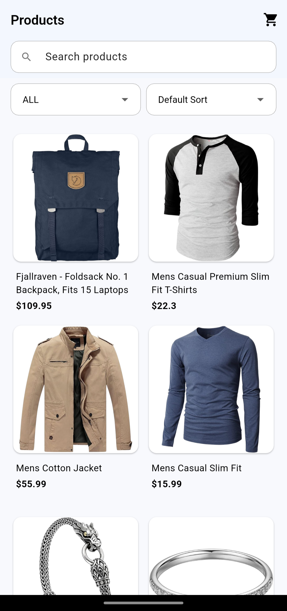
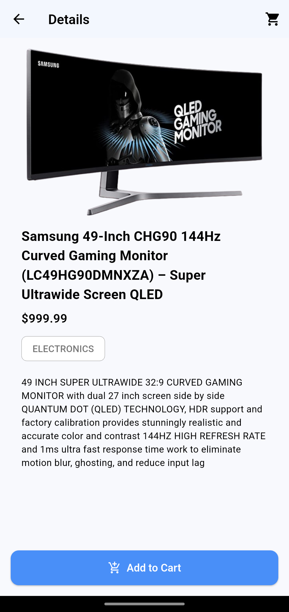
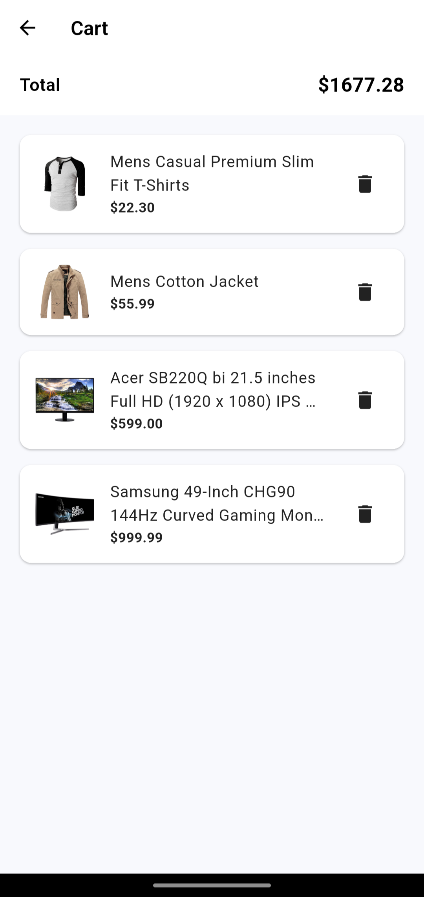

# Product Catalogue

## Screenshots

| Products | Product Detail | Cart |
|-------------|----------------|-------------|
||||

## Features

- Browse list of products
- Search, filter, sort products
- Product details page
- Add and remove products in cart
- Tests, animations

## Packages

- [`flutter_bloc`](https://pub.dev/packages/flutter_bloc) – Bloc state management 
- [`auto_route`](https://pub.dev/packages/auto_route) – Routing
- [`retrofit`](https://pub.dev/packages/retrofit) – Api client generator
- [`dio`](https://pub.dev/packages/dio) – Http client
- [`realm`](https://pub.dev/packages/realm) – Local database
- [`freezed`](https://pub.dev/packages/freezed) – Immutable models generator
- [`talker`](https://pub.dev/packages/talker) – Logging
- [`bloc_test`](https://pub.dev/packages/bloc_test) – Unit testing blocs
- [`mocktail`](https://pub.dev/packages/mocktail) – Mocking dependencies in tests
- [`rxdart`](https://pub.dev/packages/rxdart) – Reactive streams
- [`get_it`](https://pub.dev/packages/get_it) – Dependency injection

## Getting Started

1. Clone repository
2. `flutter pub get`
3. `flutter run`
